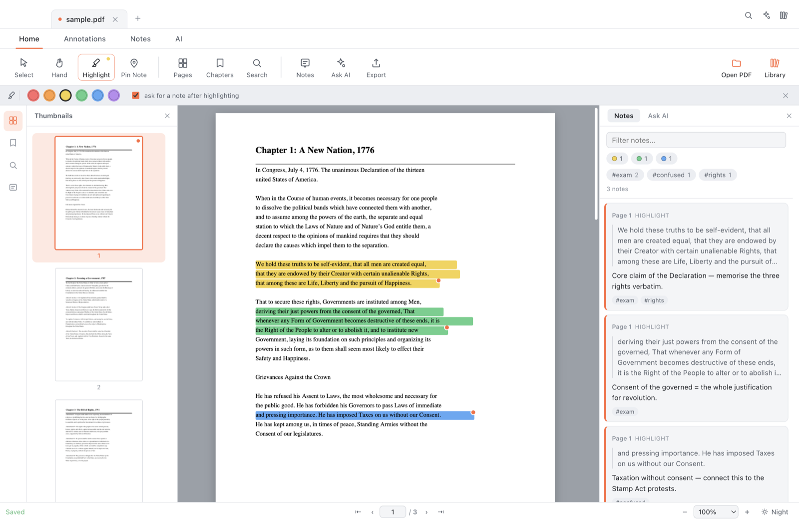

# Marginalia

A desktop PDF reader for studying. Highlight text, attach notes, tag them, see every
note in one panel, and ask a **local** AI about the document *and* about your own notes —
without anything leaving your machine.

Built because reading an 800-page textbook in a generic PDF viewer means your thinking
ends up scattered across a separate document.



*A sample PDF (`docs/sample.pdf`, public-domain text) with highlights, notes, and tags.*

## What it does

**Annotate**
- Select text → highlight in one of six colours; a popup offers highlight, note, copy, or "ask the AI about this".
- Drop a pin anywhere on a page for margin thoughts that aren't attached to a sentence — diagrams, maps, charts.
- Attach a note and comma-separated tags (`exam`, `confused`) to any highlight or pin.

**See everything at once**
- A right-hand panel lists every note in reading order, the way comments work in a shared document.
- Filter by text, by highlight colour, or by tag. Click a note to jump to its exact spot on the page.
- Export the lot to Markdown — quoted passage, your note, and tags, grouped by page.

**Find your way around 800 pages**
- Virtualised rendering: only the pages near the viewport are ever drawn, so scroll stays smooth.
- Thumbnails, full-text search with on-page hit highlighting, and a chapter list.
- If a PDF has no embedded outline, Marginalia derives one from chapter headings in the text.
- It remembers your page, scroll position, and zoom per document, and reopens there.

**Ask a local AI**
- Ranks the document's pages *and* your own notes against your question, then answers from what it found.
- It always distinguishes the two: *"your note on p. 112 says…"* versus a page citation `[p. 112]`.
- Citations are clickable, and a sources drawer under each answer shows exactly what the model was given.
- Runs through [Ollama](https://ollama.com) on your machine. No API key, no network.

**Everything stays local**
- Highlights and notes save to a plain `<pdf name>.notes.json` file *next to the PDF*.
  Readable, diffable, backed up with the PDF, and the PDF itself is never modified.
- If the PDF's folder isn't writable, notes fall back to app storage automatically.

### Asking the local AI


The model was given two passages from the PDF and the reader's own notes, and its answer
keeps them apart — *"The reader noted that…"* is never presented as something the book said.

## Requirements

- macOS (Apple Silicon or Intel)
- [Node.js](https://nodejs.org) 20+ to build
- [Ollama](https://ollama.com) — only for the AI panel; everything else works without it

## Run it

```bash
npm install
npm start
```

`npm install` also copies the pdf.js runtime into `vendor/`, which the app loads directly.

To open a PDF straight away:

```bash
npm start -- "/path/to/book.pdf"
```

### Build a real .app

```bash
npm run dist
```

The `.dmg` and `.zip` land in `dist/`. The build is unsigned, so the first launch needs
right-click → Open.

## Setting up the AI

Install Ollama, then pull a small model — Marginalia starts the Ollama server itself if
it isn't already running, and preloads the model so the first answer isn't slow.

```bash
ollama pull llama3.2:3b
```

Pick a model in the **AI** ribbon tab. On a 8 GB machine a 1–3B model answers in a few
seconds; an 8B model is noticeably sharper but slower and memory-hungry, since it competes
with the renderer for RAM.

Retrieval is lexical (BM25 with phrase and note-intent handling) and runs in a few
milliseconds over an 800-page book — no embedding model, no index server, no waiting.

## Keyboard

| | |
|---|---|
| `⌘O` / `⌘L` | Open PDF / Library |
| `⌘F` | Search, `↵` / `⇧↵` to step through hits |
| `⌘1` `⌘2` `⌘3` `⌘4` | Thumbnails · Chapters · Notes · Ask AI |
| `v` `h` `p` `space` | Select · Highlight · Pin · Hand |
| `←` `→` | Previous / next page |
| `⌘+` `⌘-` `⌘0` | Zoom in · out · fit width |
| `⌘D` | Day / night |
| `⌘E` | Export notes |

`⌘`-scroll zooms.

## How it's put together

```
src/main/        Electron main process
  main.js          window, IPC, streaming AI responses
  store.js         settings, library index, sidecar notes, text cache
  retrieval.js     BM25 ranking over pages and notes (no dependencies)
  ollama.js        local model discovery, warm-up, grounded prompt, streaming
src/renderer/    the UI — plain ES modules, no framework, no build step
  js/viewer.js     pdf.js loading, virtualised pages, text + annotation layers
  js/annotations.js  selection → normalised rects, highlights, pins, editor
  js/notes.js      the notes panel, filters, tags
  js/search.js     full-text search and on-page hit mapping
  js/ai.js         chat panel, streaming, citations, sources
```

Highlight geometry is stored as fractions of the page box, so annotations stay put at
any zoom level and on any display.

## Notes file format

```json
{
  "version": 1,
  "docId": "e5a624d3a5fb2aa5…",
  "annotations": [
    {
      "id": "m1a2b3",
      "type": "highlight",
      "page": 112,
      "rects": [{ "x": 0.12, "y": 0.34, "w": 0.61, "h": 0.014 }],
      "quote": "Dickinson argued that the idea of no taxation without representation…",
      "note": "Likely FRQ — consent of assemblies.",
      "tags": ["exam", "taxation"],
      "color": "#f6d34a"
    }
  ],
  "lastPosition": { "page": 112, "within": 0.2, "zoomMode": "1" }
}
```

`docId` fingerprints the file's size and contents, so notes survive a rename or a move.

## Licence

MIT
