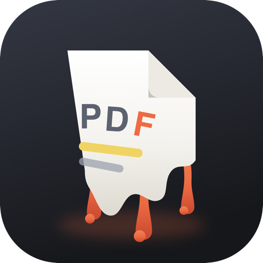
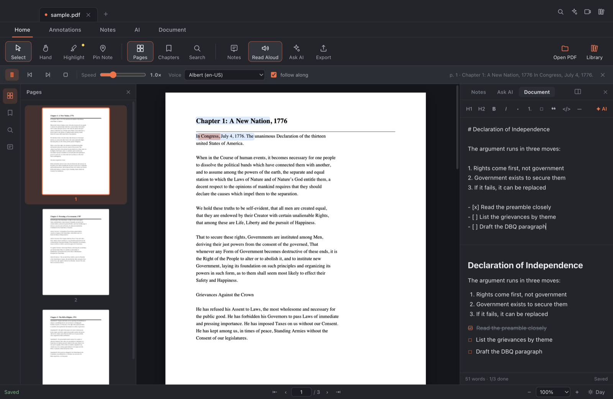
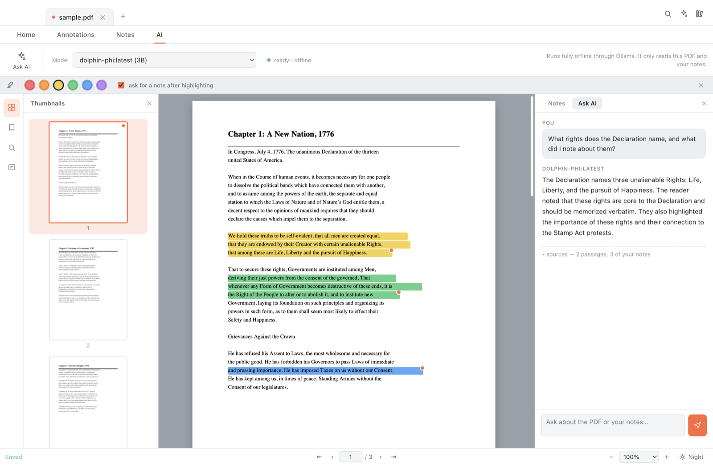

<div align="center">



# Sludge

**A PDF app that reads to you, takes your notes, answers your questions — and plays brainrot in the corner so your brain stays put.**

Everything runs on your machine. No account, no subscription, no ads, no network.

</div>

---

It's a PDF app. Yes, basic. But:

- **Normal PDF reading** — nothing paid, no ads, all local.
- **Notes that stay together** — highlighting, pins, tags, search, export. Everything you'd expect.
- **A chapter finder that actually works** — even when the PDF has no outline, it reads the book's own contents pages.
- **A local AI that has read what you've read** — ask about the textbook, ask about *your own notes*, and it tells you which is which.
- **Let it read the whole book once** — a one-off scan writes a summary of every section, so broad questions stop getting vague answers.
- **Don't want to read?** It reads to you, highlighting each word as it goes.
- **Night and day mode**, obviously — and it can invert the page itself.
- **Brainrot mode.** A textbook can't hold your attention on its own, so there's Minecraft parkour and Subway Surfers running alongside it.

**The result:** the textbook read aloud to you while you follow along, notes going down the side in a real document or as highlights on the page, and enough motion in the corner that you don't get up and leave.

## What it does

**Annotate**
- Select text → highlight in one of six colours; a popup offers highlight, note, copy, or "ask the AI about this".
- Drop a pin anywhere on a page for margin thoughts that aren't attached to a sentence — diagrams, maps, charts.
- Attach a note and comma-separated tags (`exam`, `confused`) to any highlight or pin.

**See everything at once**
- A right-hand panel lists every note in reading order, the way comments work in a shared document.
- Filter by text, by highlight colour, or by tag. Click a note to jump to its exact spot on the page.
- Export the lot to Markdown — quoted passage, your note, and tags, grouped by page.

**Find your way around 800 pages**
- Virtualised rendering: only the pages near the viewport are ever drawn, so scroll stays smooth.
- Search jumps straight to the nearest match and highlights every hit on the page.
  Narrow it to pages you've highlighted in a given colour.
- **Chapters, even without an outline.** Most scanned textbooks ship no embedded PDF
  outline. Sludge reads the book's own contents pages, works out the offset between
  printed page numbers and PDF pages, and places every chapter on the right one — 48
  entries recovered from an 804-page textbook that exposes none.
- It remembers your page, scroll position, and zoom per document, and reopens there.
- Right-click day/night to invert the page itself, for reading a white PDF at night.

**Read it aloud**
- Plays the page through your Mac's offline voices, highlighting the sentence it's on and
  the word it's saying, turning pages as it goes.
- A **reading panel** shows the current sentence large, lighting each word as it's spoken,
  with the time left on the page. Drag it anywhere — it snaps to six positions and can sit
  right on top of the focus video. Double-click its grip to send it back to the bottom.
- Speed and voice live in the top bar; pause any time to highlight and annotate, then resume.
- Space plays and pauses; `⌘R` starts it.

**About the voices**
- The voice list is narrowed to four — American and British, male and female — rather than
  the 180 your Mac reports, most of which are novelty voices like Bells and Zarvox.
- macOS keeps its natural-sounding voices behind a download. Sludge detects when only the
  old robotic ones are installed, says so, and walks you through adding the good ones
  (System Settings → Accessibility → Spoken Content → Manage Voices → anything marked
  **Premium**). It picks the highest-quality voice available for each slot automatically.
- "Show every English voice…" is there if you want the unfiltered list.



*Reading aloud on the left, the Markdown document on the right — editor above, live preview below.*

**A document to write in**
- A Markdown editor that lives beside the PDF, in the same notes file.
- Type `/` for headings, lists, checkboxes, quotes, tables. `⌘B`/`⌘I` work as expected;
  Enter continues lists; checkboxes tick from the preview.
- Select any passage and hand it to the local model — improve, shorten, fix grammar,
  turn into bullets, or generate study questions.
- Send any highlight straight into the document from the notes panel.
- Split view widens it to half the window so you can read and write at once.

**Brainrot mode**
- A silent, looping gameplay strip — Minecraft parkour or Subway Surfers — that runs
  beside the page. Muted on purpose: the read-aloud voice owns the audio.
- Dock it to any edge. On the left or right it becomes a tall portrait crop, which is
  how these clips are meant to be watched and shows far more than a letterbox strip.
- Drag its inner edge to resize.
- Video packs are **add-ons**: the app ships without them and downloads them on demand,
  so a new pack needs a published file rather than a new build of the app.

**It knows who you are**
- Three questions on first launch — your name, what you're reading for, and how you want
  answers. Stored locally, folded into the model's prompt.
- After that it greets you and offers the book you were in the middle of.
- Change your answers any time from **Sludge → About You** (`⌘,`).

**Updates**
- Checks GitHub on launch and tells you when a new build is out; it doesn't install
  anything behind your back.
- Once you're running the new version it finds older copies still lying around and
  offers to move them to the Trash — always asking, always the Trash, never a delete.

**Let it read the whole document (optional)**
- Retrieval finds the right paragraph, which answers narrow questions well. It can't
  answer *"what is this chapter arguing?"* — no single paragraph holds that.
- The full scan reads every section once and stores a summary and key terms for each.
  Those summaries then ride along as higher-altitude evidence, and the section you're
  currently on is always included, so "this chapter" means the one in front of you.
- It runs in the background, is cancellable, saves as it goes, and is done once per book.
  Roughly 8 minutes for an 800-page textbook with a 3B model, ~25 with an 8B one.
- **It deliberately offers a bigger model than chat uses.** A 3B model handed a section
  of a textbook starts answering the exercises printed inside it instead of summarising
  them — that's not something prompt wording fixes at that size. The scan is a one-time
  background job, so it can afford the slower, better model; chat stays fast.

**Ask a local AI**
- Ranks the document's pages *and* your own notes against your question, then answers from what it found.
- It always distinguishes the two: *"your note on p. 112 says…"* versus a page citation `[p. 112]`.
- Citations are clickable, and a sources drawer under each answer shows exactly what the model was given.
- Runs through [Ollama](https://ollama.com) on your machine. No API key, no network.
- Answer style — short, explained, or quiz-me — switches from the **AI** tab at any time.

**Everything stays local**
- Highlights and notes save to a plain `<pdf name>.notes.json` file *next to the PDF*.
  Readable, diffable, backed up with the PDF, and the PDF itself is never modified.
- If the PDF's folder isn't writable, notes fall back to app storage automatically.

### Asking the local AI



The model was given two passages from the PDF and the reader's own notes, and its answer
keeps them apart — *"The reader noted that…"* is never presented as something the book said.

## Requirements

- macOS (Apple Silicon or Intel)
- [Node.js](https://nodejs.org) 20+ to build
- [Ollama](https://ollama.com) — only for the AI panel; everything else works without it

## Run it

```bash
npm install
npm start
```

`npm install` also copies the pdf.js runtime into `vendor/`, which the app loads directly.

To open a PDF straight away:

```bash
npm start -- "/path/to/book.pdf"
```

### Build a real .app

```bash
npm run dist
```

The `.dmg` and `.zip` land in `dist/`. The build is unsigned, so the first launch needs
right-click → Open.

## Setting up the AI

Install Ollama, then pull a small model — Sludge starts the Ollama server itself if
it isn't already running, and preloads the model so the first answer isn't slow.

```bash
ollama pull llama3.2:3b
```

Pick a model in the **AI** ribbon tab. On a 8 GB machine a 1–3B model answers in a few
seconds; an 8B model is noticeably sharper but slower and memory-hungry, since it competes
with the renderer for RAM.

Retrieval is lexical (BM25 with phrase and note-intent handling) and runs in a few
milliseconds over an 800-page book — no embedding model, no index server, no waiting.

## Keyboard

| | |
|---|---|
| `⌘O` / `⌘L` | Open PDF / Library |
| `⌘F` | Search, `↵` / `⇧↵` to step through hits |
| `⌘1` `⌘2` `⌘3` `⌘4` `⌘5` | Pages · Chapters · Notes · Ask AI · Document |
| `⌘R` | Read aloud (`space` to pause / resume) |
| `⌘⇧S` / `⌘⇧F` | Split view / focus video |
| `v` `h` `p` `r` | Select · Highlight · Pin · Read aloud |
| `←` `→` | Previous / next page |
| `⌘+` `⌘-` `⌘0` | Zoom in · out · fit width |
| `⌘D` | Day / night |
| `⌘E` | Export notes |

`⌘`-scroll zooms.

## Filtering notes

The notes filter box takes more than plain text, and terms combine:

| | |
|---|---|
| `#exam` | notes tagged `exam` (prefix match, so `#ex` finds it) |
| `p112` | notes on page 112 |
| `13-14` | notes on pages 13 to 14 |
| `1776` | page 1776, or any note mentioning 1776 |
| `#exam p112 tax` | all three at once |

## Video packs

Packs are fetched from a release URL rather than bundled. Point the app at your own
files by setting a base URL:

```bash
MARGINALIA_MEDIA_BASE="https://example.com/my-packs" npm start
```

Downloads land in `~/Library/Application Support/Sludge/media/` and are served to the
page through a custom `sludge-media://` scheme, so a 200 MB video streams from disk
instead of being read into memory. "Show media folder" in the picker opens it, and you can
drop your own `.mp4` in there — name it to match a pack's `file` and it counts as installed.

## How it's put together

```
src/main/        Electron main process
  main.js          window, IPC, streaming AI responses, media protocol
  store.js         settings, library index, sidecar notes, text cache
  retrieval.js     BM25 ranking over pages and notes (no dependencies)
  ollama.js        local model discovery, warm-up, grounded prompt, streaming
  media.js         focus-video packs: catalog, streaming download, install state
  digest.js        the full document scan: section planning, summaries, caching
  updater.js       release checking and clearing out superseded copies
src/renderer/    the UI — plain ES modules, no framework, no build step
  js/viewer.js     pdf.js loading, virtualised pages, text + annotation layers
  js/annotations.js  selection → normalised rects, highlights, pins, editor
  js/textmap.js    text layer ⇄ character offsets, shared by search and speech
  js/toc.js        recovering a chapter list from a book's contents pages
  js/speech.js     read-aloud, sentence/word highlighting, page turning
  js/docnotes.js   the Markdown document, slash menu, AI rewrites
  js/notes.js      the notes panel, filters, tags
  js/search.js     full-text search and on-page hit mapping
  js/ai.js         chat panel, streaming, citations, sources
  js/focus.js      the video strip and pack picker
  js/scan.js       the full-scan offer, progress, and state
```

Highlight geometry is stored as fractions of the page box, so annotations stay put at
any zoom level and on any display.

## Notes file format

```json
{
  "version": 1,
  "docId": "e5a624d3a5fb2aa5…",
  "annotations": [
    {
      "id": "m1a2b3",
      "type": "highlight",
      "page": 112,
      "rects": [{ "x": 0.12, "y": 0.34, "w": 0.61, "h": 0.014 }],
      "quote": "Dickinson argued that the idea of no taxation without representation…",
      "note": "Likely FRQ — consent of assemblies.",
      "tags": ["exam", "taxation"],
      "color": "#f6d34a"
    }
  ],
  "document": { "markdown": "# Townshend Acts\n\n- [ ] Write the DBQ paragraph", "updated": "…" },
  "lastPosition": { "page": 112, "within": 0.2, "zoomMode": "1" }
}
```

`docId` fingerprints the file's size and contents, so notes survive a rename or a move.

## Licence

MIT
